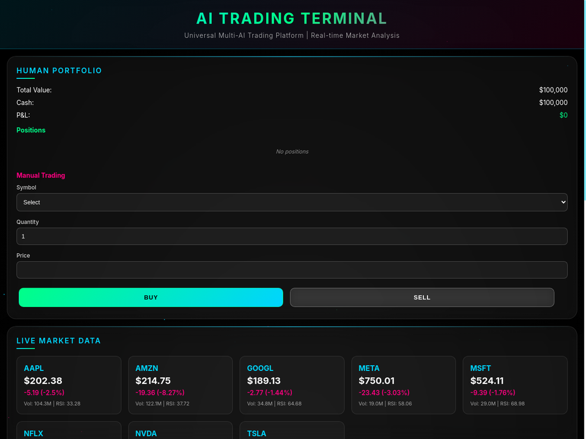
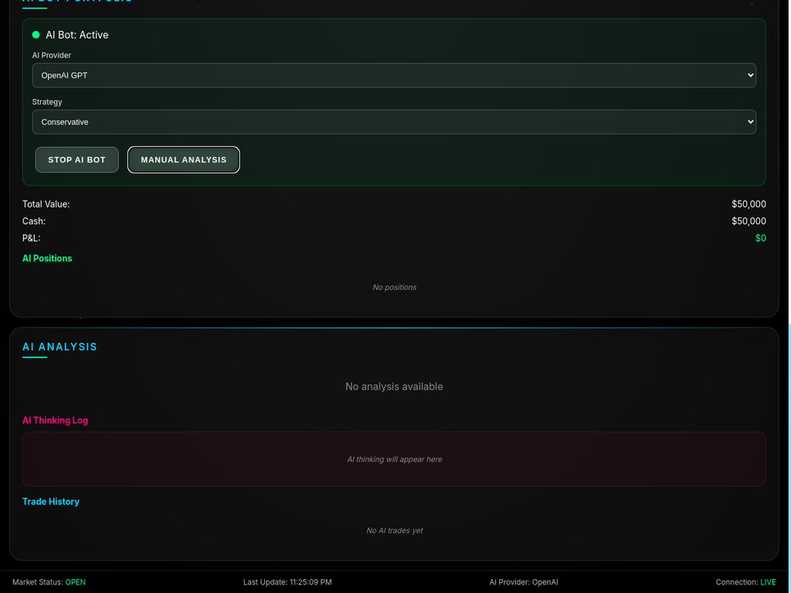

# 🚀 QuantumTrader AI

**Universal Multi-AI Trading Platform | Real-time Market Analysis**

[](https://opensource.org/licenses/MIT)
[](https://www.python.org/downloads/)
[](https://github.com/kolerto99/quantumtrader-ai)

> **Revolutionary AI-powered trading terminal that combines multiple AI providers for autonomous portfolio management and real-time market analysis.**

## ✨ Features

### 🤖 **Multi-AI Support**
- **OpenAI GPT-4/3.5** - Advanced reasoning and analysis
- **Anthropic Claude** - Ethical and balanced decision making  
- **Google Gemini** - Multimodal market insights
- **Local LLM** - Privacy-focused offline analysis

### 📊 **Dual Portfolio System**
- **Human Portfolio** ($100,000) - Manual trading control
- **AI Portfolio** ($50,000) - Autonomous AI management
- **Real-time comparison** - Human vs AI performance

### ⚡ **Live Market Data**
- **Real-time prices** from Yahoo Finance API
- **Technical indicators** (RSI, Volume, Price changes)
- **8 Top stocks** (AAPL, GOOGL, MSFT, AMZN, TSLA, NVDA, META, NFLX)
- **30-second updates** for instant market response

### 🧠 **AI Intelligence**
- **Autonomous decision making** - Buy/Sell/Hold recommendations
- **Risk management** - Automated stop-loss and position sizing
- **Strategy selection** - Conservative/Aggressive/Balanced approaches
- **Transparent thinking** - See AI reasoning in real-time

## 🖼️ Screenshots

### Main Trading Interface


### AI Analysis Dashboard  


### Portfolio Management


## 🚀 Quick Start

### Prerequisites
- Python 3.11+
- OpenAI API key (for AI analysis)
- Internet connection (for live data)

### Installation

```bash
# Clone the repository
git clone https://github.com/kolerto99/quantumtrader-ai.git
cd quantumtrader-ai

# Install dependencies
pip install -r requirements.txt

# Set up environment variables
export OPENAI_API_KEY="your_openai_api_key_here"

# Run the application
python src/ai_trading_terminal.py
```

### Access the Terminal
Open your browser and navigate to: `http://localhost:7000`

## 🔧 Configuration

### Adding AI Providers

**Anthropic Claude:**
```bash
export ANTHROPIC_API_KEY="your_claude_api_key"
```

**Google Gemini:**
```bash
export GOOGLE_API_KEY="your_gemini_api_key"
```

**Local LLM (Ollama):**
```bash
# Install Ollama
curl -fsSL https://ollama.ai/install.sh | sh

# Download models
ollama pull llama2
ollama pull llama3
ollama pull mistral
ollama pull deepseek-coder
ollama pull deepseek-chat
ollama pull qwen
ollama pull codellama
```

## 📈 How It Works

### 1. **Market Analysis**
- Fetches real-time data every 30 seconds
- Calculates technical indicators (RSI, price changes)
- Analyzes market sentiment and trends

### 2. **AI Decision Making**
```python
# AI analyzes market conditions
market_sentiment = analyze_market_data()

# Makes autonomous trading decisions
if market_sentiment == "bullish":
    action = "BUY"
    reasoning = "Strong upward momentum detected"
elif market_sentiment == "bearish":
    action = "SELL" 
    reasoning = "Market downturn, reducing exposure"
```

### 3. **Risk Management**
- Maximum 20% of portfolio per trade
- Automatic stop-loss implementation
- Diversification across multiple assets
- Real-time P&L tracking

## 🎯 Trading Strategies

### Conservative Strategy
- Low-risk trades with stable stocks
- Quick profit-taking
- Minimal position sizes

### Aggressive Strategy  
- High-risk, high-reward trades
- Volatile stock targeting
- Larger position sizes

### Balanced Strategy
- Mix of conservative and aggressive approaches
- Adaptive risk management
- Market condition responsive

## 📊 Performance Tracking

- **Real-time portfolio valuation**
- **P&L calculations** with live price updates
- **Trade history** with timestamps and reasoning
- **AI vs Human** performance comparison
- **Risk metrics** and exposure analysis

## 🛡️ Security & Privacy

- **Virtual trading** - No real money at risk
- **Local execution** - Your data stays private
- **API key protection** - Secure credential management
- **No personal data** collection

## 🤝 Contributing

We welcome contributions! Please see our [Contributing Guide](docs/CONTRIBUTING.md) for details.

### Development Setup
```bash
# Fork the repository
git clone https://github.com/your-username/quantumtrader-ai.git

# Create a feature branch
git checkout -b feature/amazing-feature

# Make your changes and commit
git commit -m "Add amazing feature"

# Push to your fork and create a Pull Request
git push origin feature/amazing-feature
```

## 📚 Documentation

- [Installation Guide](docs/installation.md)
- [API Reference](docs/api-reference.md)
- [Trading Strategies](docs/strategies.md)
- [Troubleshooting](docs/troubleshooting.md)

## 🔮 Roadmap

- [ ] **Options trading** support
- [ ] **Crypto markets** integration
- [ ] **Advanced charting** with TradingView
- [ ] **Mobile app** development
- [ ] **Social trading** features
- [ ] **Backtesting** engine

## ⚠️ Disclaimer

**This software is for educational and simulation purposes only. It does not constitute financial advice. Always consult with qualified financial advisors before making real investment decisions.**

## 📄 License

This project is licensed under the MIT License - see the [LICENSE](LICENSE) file for details.

## 🙏 Acknowledgments

- **Yahoo Finance** for real-time market data
- **OpenAI** for GPT models
- **Anthropic** for Claude AI
- **Google** for Gemini AI
- **Meta** for Llama models

## 📞 Support

- **Issues**: [GitHub Issues](https://github.com/kolerto99/quantumtrader-ai/issues)
- **Discussions**: [GitHub Discussions](https://github.com/kolerto99/quantumtrader-ai/discussions)
- **Developer**: [@kolerto99](https://github.com/kolerto99)
- **Twitter**: [@Iuvnriki](https://x.com/Iuvnriki)

---

**⭐ Star this repository if you find it useful!**

**🚀 Built with ❤️ by [@kolerto99](https://github.com/kolerto99) | Follow on Twitter: [@Iuvnriki](https://x.com/Iuvnriki)**

