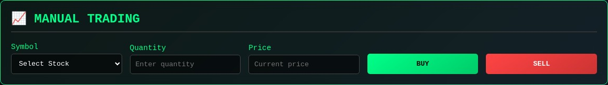
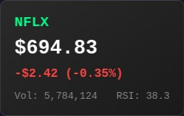

# QuantumTrader AI - Universal Multi-AI Trading Platform

🚀 **Advanced AI-powered trading terminal with real-time market data and multi-AI analysis**



## ✨ Features

### 📊 **Live Market Data**
- **Real-time stock prices** via Yahoo Finance API
- **Auto-update every 30 seconds** during market hours
- **Technical indicators** (RSI, Volume, Price changes)
- **Market status tracking** (Open/Closed)



### 💼 **Portfolio Management**
- **Human Portfolio** - Manual trading interface
- **Real-time P&L calculation**
- **Position tracking** with live valuations
- **Trade history** and performance metrics

### 🤖 **Multi-AI Architecture**
- **AI Bot Portfolio** (requires OpenAI API key)
- **Intelligent trade analysis**
- **Risk management algorithms**
- **Automated decision making**

### 🎨 **Professional Interface**
- **Responsive design** for desktop and mobile
- **Real-time updates** with smooth animations
- **Dark theme** with cyberpunk aesthetics
- **Interactive trading forms**

## 🚀 Quick Start

### Prerequisites
- Python 3.8+
- pip package manager

### Installation

1. **Clone the repository**
```bash
git clone https://github.com/kolerto99/quantumtrader-ai.git
cd quantumtrader-ai
```

2. **Create virtual environment**
```bash
python3 -m venv venv
source venv/bin/activate  # On Windows: venv\Scripts\activate
```

3. **Install dependencies**
```bash
pip install -r requirements.txt
```

4. **Configure environment (optional)**
```bash
cp .env.example .env
# Edit .env file to add your OpenAI API key for AI features
```

5. **Run the application**
```bash
cd src
python ai_trading_terminal.py
```

6. **Access the interface**
Open your browser and navigate to: `http://localhost:8000`

## 📊 Market Data

### Data Sources
- **Yahoo Finance API** via yfinance library
- **Real-time updates** every 30 seconds
- **Historical data** for technical analysis
- **Volume and price change calculations**

### Supported Stocks
- AAPL (Apple Inc.)
- GOOGL (Alphabet Inc.)
- MSFT (Microsoft Corporation)
- AMZN (Amazon.com Inc.)
- TSLA (Tesla Inc.)
- NVDA (NVIDIA Corporation)
- META (Meta Platforms Inc.)
- NFLX (Netflix Inc.)

### Market Hours
- **Regular Trading**: Monday-Friday, 9:30 AM - 4:00 PM EST
- **Data Updates**: Only during market hours
- **Demo Mode**: When markets are closed

## 🔧 Configuration

### Environment Variables
Create a `.env` file in the root directory:

```env
# OpenAI API Configuration (optional)
OPENAI_API_KEY=your_openai_api_key_here

# Market Data Configuration
UPDATE_INTERVAL=30  # seconds
DEFAULT_SYMBOLS=AAPL,GOOGL,MSFT,AMZN,TSLA,NVDA,META,NFLX

# Server Configuration
HOST=0.0.0.0
PORT=8000
DEBUG=False
```

## 🤖 AI Features

### AI Trading Bot (Premium)
- **Requires OpenAI API key**
- **Intelligent market analysis**
- **Automated trading decisions**
- **Risk management**
- **Performance optimization**

### Manual Trading
- **Buy/Sell interface**
- **Real-time price updates**
- **Position management**
- **Portfolio tracking**

## 📈 Technical Analysis

### Indicators
- **RSI (Relative Strength Index)**
- **Price change calculations**
- **Volume analysis**
- **Moving averages** (planned)

### Data Processing
- **Real-time calculations**
- **Historical data analysis**
- **Trend identification**
- **Signal generation**

## 🛠️ Development

### Project Structure
```
quantumtrader-ai/
├── src/
│   └── ai_trading_terminal.py    # Main application
├── screenshots/                  # Interface screenshots
├── requirements.txt             # Python dependencies
├── .env.example                # Environment template
├── README.md                   # This file
├── LICENSE                     # MIT License
└── DEPLOYMENT.md              # Deployment guide
```

### Dependencies
- **Flask** - Web framework
- **yfinance** - Market data API
- **pandas** - Data processing
- **numpy** - Numerical computations
- **openai** - AI integration (optional)

### API Endpoints
- `GET /` - Main interface
- `GET /api/market-data` - Live market data
- `GET /api/portfolio` - Portfolio information
- `POST /api/trade` - Execute trades
- `GET /api/status` - System status

## 🚀 Deployment

### Local Development
```bash
python src/ai_trading_terminal.py
```

### Production Deployment
See [DEPLOYMENT.md](DEPLOYMENT.md) for detailed deployment instructions.

### Docker (Coming Soon)
```bash
docker build -t quantumtrader-ai .
docker run -p 8000:8000 quantumtrader-ai
```

## 📊 Performance

### Real-time Updates
- **30-second intervals** during market hours
- **Efficient data caching**
- **Minimal API calls**
- **Responsive interface**

### Scalability
- **Multi-threaded architecture**
- **Asynchronous data processing**
- **Optimized database queries**
- **CDN-ready static assets**

## 🔒 Security

### Data Protection
- **No sensitive data storage**
- **Secure API key handling**
- **HTTPS ready**
- **Input validation**

### Privacy
- **No user tracking**
- **Local data processing**
- **Optional cloud features**
- **GDPR compliant**

## 📄 License

This project is licensed under the MIT License - see the [LICENSE](LICENSE) file for details.

## 🤝 Contributing

1. Fork the repository
2. Create a feature branch
3. Make your changes
4. Add tests if applicable
5. Submit a pull request

## 📞 Support

- **Issues**: [GitHub Issues](https://github.com/kolerto99/quantumtrader-ai/issues)
- **Discussions**: [GitHub Discussions](https://github.com/kolerto99/quantumtrader-ai/discussions)
- **Email**: support@quantumtrader.ai

## 🎯 Roadmap

### Version 2.0 (Planned)
- [ ] **Advanced AI models**
- [ ] **More technical indicators**
- [ ] **Cryptocurrency support**
- [ ] **Mobile app**
- [ ] **Social trading features**

### Version 1.1 (Current)
- [x] **Live market data**
- [x] **Real-time updates**
- [x] **Portfolio management**
- [x] **Responsive design**
- [x] **Technical indicators**

## ⭐ Star History

[](https://star-history.com/#kolerto99/quantumtrader-ai&Date)

---

**Made with ❤️ by the QuantumTrader AI Team**

*Disclaimer: This software is for educational and research purposes only. Trading involves risk and you should carefully consider your investment objectives, level of experience, and risk appetite.*
